# 媒体与认知表情识别大作业

程凯越 无93 2018011113

chengky18@mails.tsinghua.edu.cn

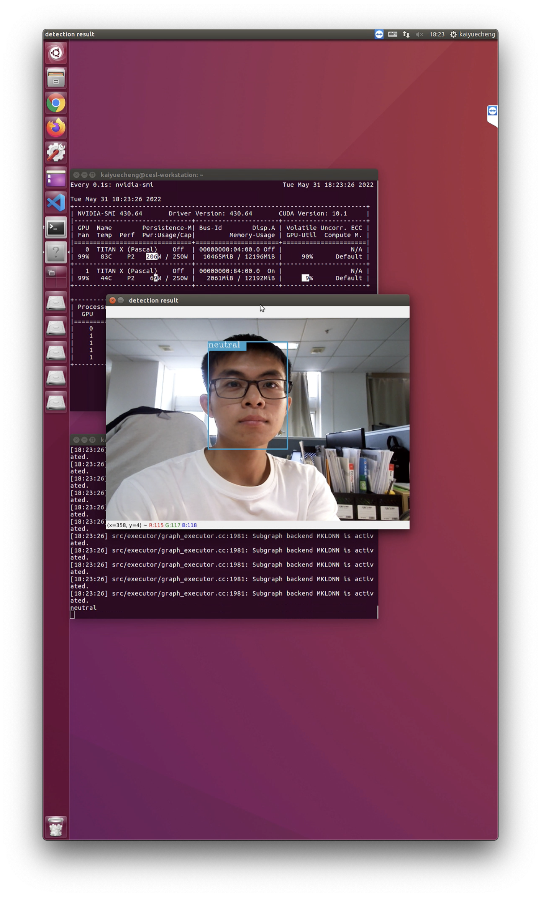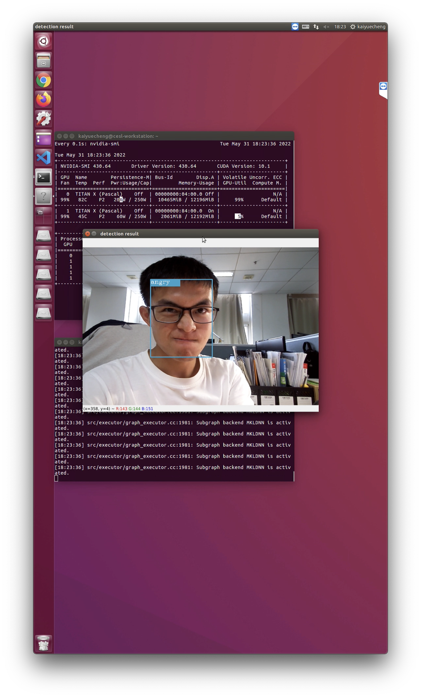

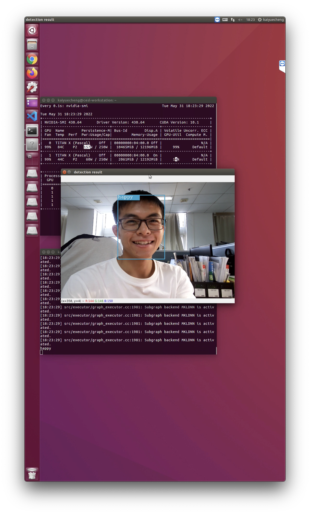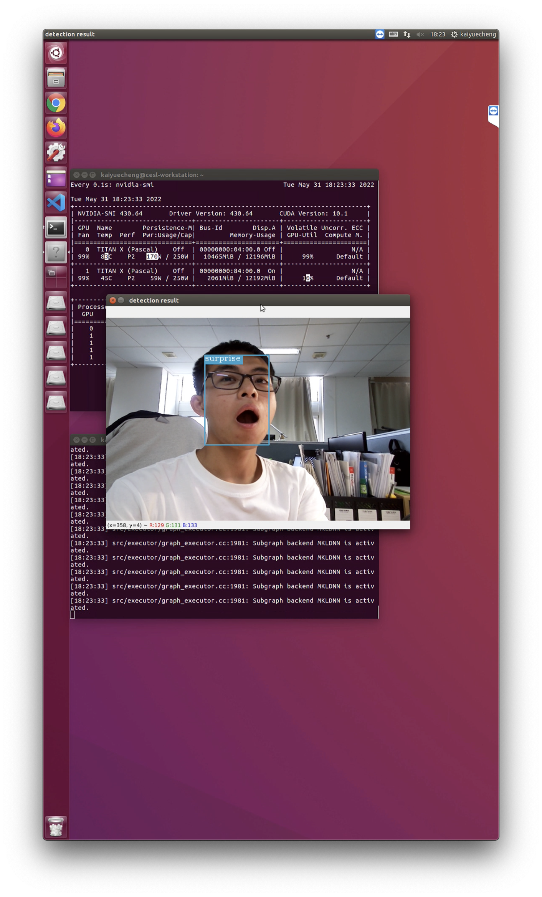


**摘要**

我们在表情识别任务中，训练了一个VGG16分类网络在测试集上达到了63.59%的准确率，并提出了一种深浅特征残差网络，在测试集上达到了61.74%的准确率，与ResNet50持平。

最开始，我们先尝试了采用`dlib`提取人脸特征（128维），然后分别采用SVM、随机森林和三层MLP进行分类，测试集上的准确率都在47%左右。

然后我们采用深度神经网络的方式进行分类。

在数据处理部分，尝试借鉴遥感领域的超分辨率重建，以提高图像的分辨率，期待对分类效果有所提升，但实际效果并不理想，分析可能是由于超分辨率重建会引入不可知的噪声。

我们尝试了AlexNet、Densenet121、GoogLeNet、MobileNetV3、ResNet18、ResNet50、VGG11和VGG16，同时自己搭建了一个深浅特征残差网络，分别使用这9类模型进行训练。

同时我们还进行了多组消融实验，以证明数据增强对神经网络性能的提升作用。

在训练过程中，我们采用tensorboard进行可视化，记录loss和acc的变化曲线。同时，我们尝试了Multi-Step的训练，先采用Adam使模型迅速收敛，再用SGD对模型进行精细调优，让二者的优劣势互补。

在测试中，我们实现了三类测试方式，分别是在测试集上、单张图像和从摄像头读取图像进行人脸检测并识别表情。

**目录**

[toc]

## 1 baseline

### 1.1 任务

1. 读懂代码结构
2. 运行基准模型
3. 给出基准模型的准确率

### 1.2 思路

1. 配置环境
2. 读懂代码
3. 运行代码

### 1.3 环境配置

#### 1.3.1 硬件信息

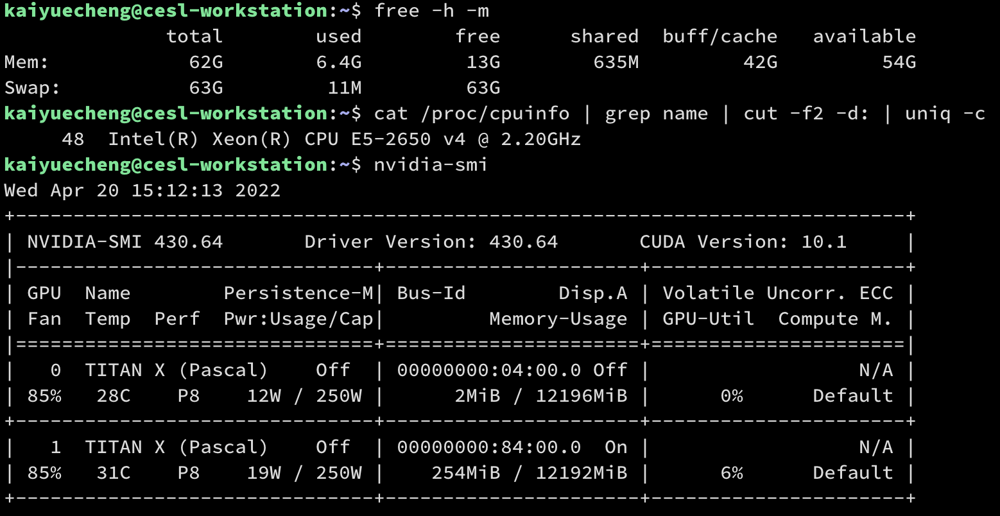

- CPU: Intel(R) Xeon(R) CPU E5-2650 v4 @ 2.20GHz $\times $ 2
- GPU: Nvidia TITAN X (Pascal) $\times $ 2
- Mem: 62GB

#### 1.3.2 系统信息

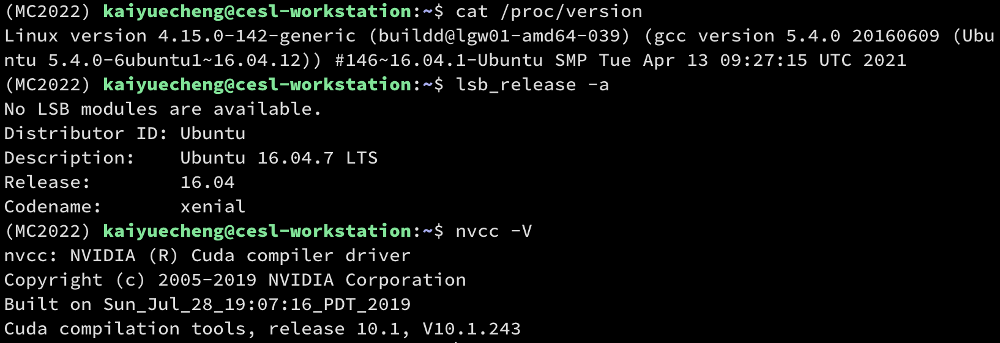

- Linux Version: 4.15.0-142-generic (buildd@lgw01-amd64-039)
- Distributor: Ubuntu 16.04.7 LTS
- CUDA Version: 10.1.243

#### 1.3.3 环境信息

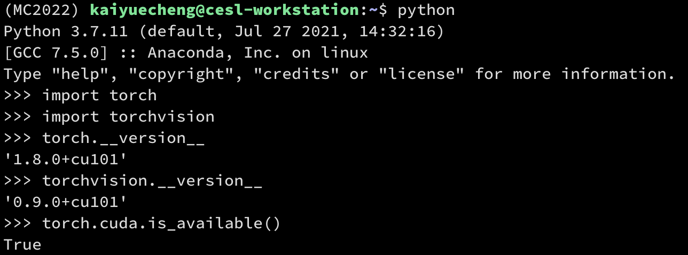

- Python Version: 3.7.11
- PyTorch Version: 1.8.0(CUDA 10.1)
- torchvision Version: 0.9.0(CUDA 10.1)

### 1.4 读懂代码

```
├── main.py	# 入口
│   ├── main	# 定义dataloader、model、optimizer、scheduler、loss function，进行训练和测试
│   ├── train	# 训练，取数据、前传、算loss、反向传递、调整学习率、保存模型
│   ├── test	# 测试，前向传递、算准确率
│   ├── entrance	# 导入args，开始运行
├── dataset.py	# 加载数据集
│   ├── tiny_caltech35	# 数据集的类
│   │   ├── __init__	# 数据集路径、加载的部分、数据转换、类别标签
│   │   ├── _load_samples_one_dir	# 加载数据集的单个部分的数据
│   │   ├── _load_samples	# 从数据集的不同部分(训练、验证、测试)加载数据
│   │   ├── __getitem__	# 取出图像和对应的label
│   │   ├── _loader	# 将单张图像转换成数据
│   │   ├── __len__	# 返回data数量
├── model.py	# 构造deep learning的模型
│   ├── base_model	# 模型的类
│   │   ├── __init__	# 定义模型的不同层
│   │   ├── forward	# 前向传递
```

### 1.5 运行

受限于篇幅，这里只展示验证和测试的结果，以及一部分的训练输出。

基准模型在验证集上的准确率为：30.218%，在测试集上的准确率为：33.640%。

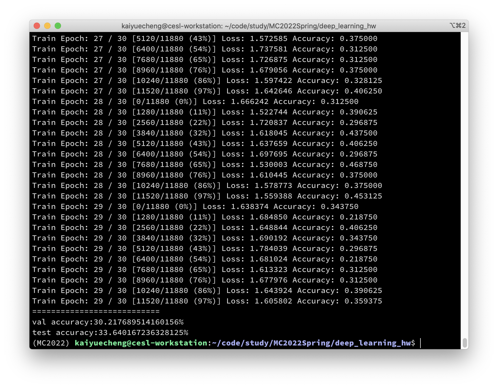

## 2 实验结果分析

### 2.1 任务

分析模型的运行结果：

1. 训练过程中loss和accuracy的变化
2. 超参数对性能的影响
3. 样本的分布特征

### 2.2 思路

1. 采用tensorboardX对训练过程中的loss和accuracy进行监控
2. 采用sklearn的TSNE对样本的特征进行降维
3. 采用seaborn对降维后的特征进行可视化
4. 重新跑一遍代码
5. 修改超参数，重新跑一遍代码

### 2.3 实现细节

- 特征：采用神经网络全连接层的输入作为特征进行降维

- 权重保存：训练完成后将权重以特定名称保存，这里采取的是`model_{time}.pth`的格式，`time`采用`%Y%m%d-%H-%M-%S`的格式

- 模型列表：创建一个保存模型信息的文件`model_list.csv`，里面的内容是`模型名称, 测试集准确率, 初始学习率, epoch数, batch size, 学习率是否特殊调整, 调整方式`

- 进度条：采用`tqdm`对于测试过程进行进度条可视化

- 保存特征：为了便于可视化，我们将`T-SNE`降维之后的特征向量保存成`.npy`格式的`numpy`文件

- Dataloader修改：添加参数`pin_memory=True, num_workers=8`以提高训练速度

- 测试内容
  - 备注：由于任务三中也包含了修改超参数来改善模型性能，所以我们理解第二问的主要目的是熟悉降维工具、可视化工具的使用，以及学会修改超参数
  - 基于上述理解，我们简单设计了一组实验，对学习率和`batch size`进行调整，测试学习率和`batch size`对于性能的影响，并且对每一次实验都进行了可视化，实验参数如下表所示：
  
  | 实验    | `learning rate` | `batch size` |
  | ------- | --------------- | ------------ |
  | 0(初始) | 0.01            | 64           |
  | 1       | 0.1             | 64           |
  | 2       | 1               | 64           |
  | 3       | 0.001           | 64           |
  | 4       | 0.1             | 32           |
  | 5       | 0.1             | 128          |
  | 6       | 0.1             | 256          |

### 2.4 实验结果

| 实验    | `learning rate` | `batch size` | `test Acc` |
| ------- | --------------- | ------------ | ---------- |
| 0(初始) | 0.01            | 64           | 0.3304     |
| 1       | 0.1             | 64           | 0.5368     |
| 2       | 1               | 64           | 0.1336     |
| 3       | 0.001           | 64           | 0.2455     |
| 4       | 0.1             | 32           | 0.5130     |
| 5       | 0.1             | 128          | 0.5197     |
| 6       | 0.1             | 256          | 0.3961     |

### 2.5 分析

#### 2.5.1 网络结构

采用tensorboardX对网络结构进行可视化。

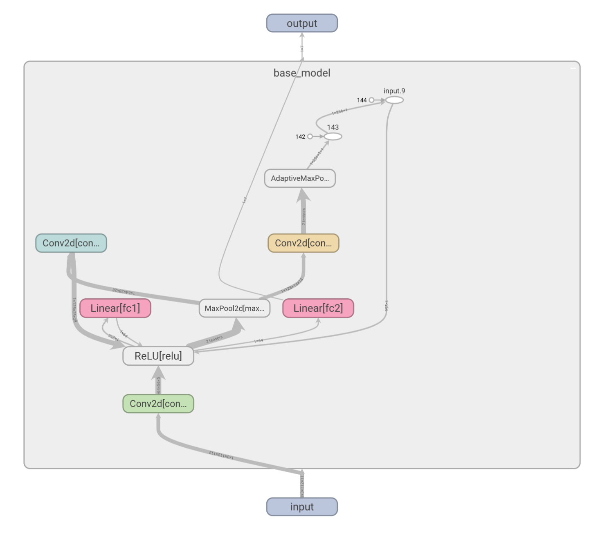

#### 2.5.2 训练中loss和accuracy记录

采用tensorboardX对训练中loss和accuracy进行记录。

- 实验0 (`learning_rate = 0.01, batch_size = 64`)

  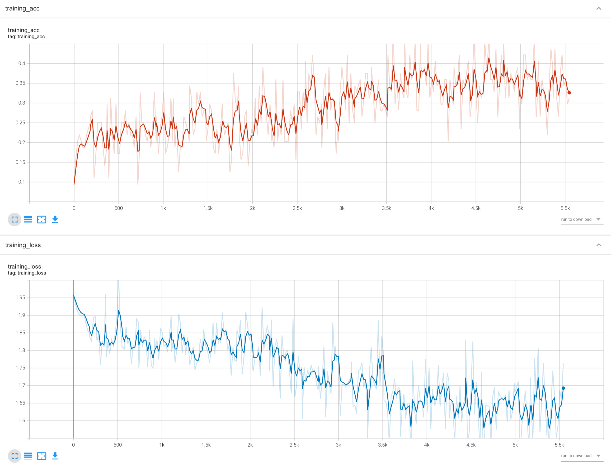

- 实验1 (`learning_rate = 0.1, batch_size = 64`)

  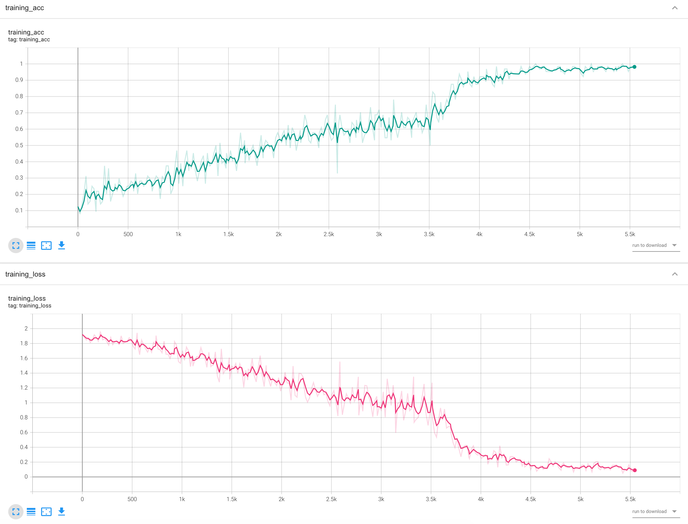

- 实验2 (`learning_rate = 1, batch_size = 64`)

  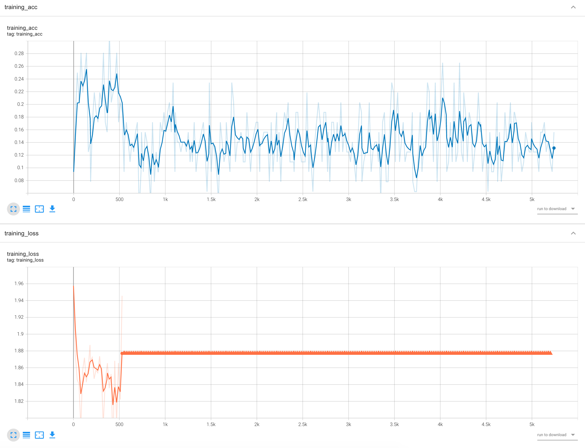

- 实验3 (`learning_rate = 0.001, batch_size = 64`)

  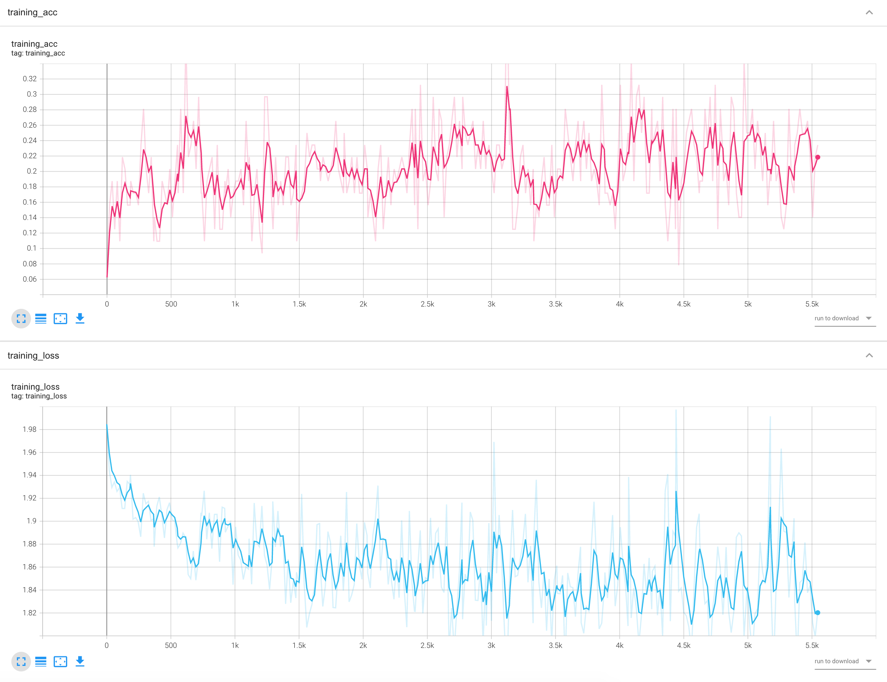

- 实验4 (`learning_rate = 0.1, batch_size = 32`)

  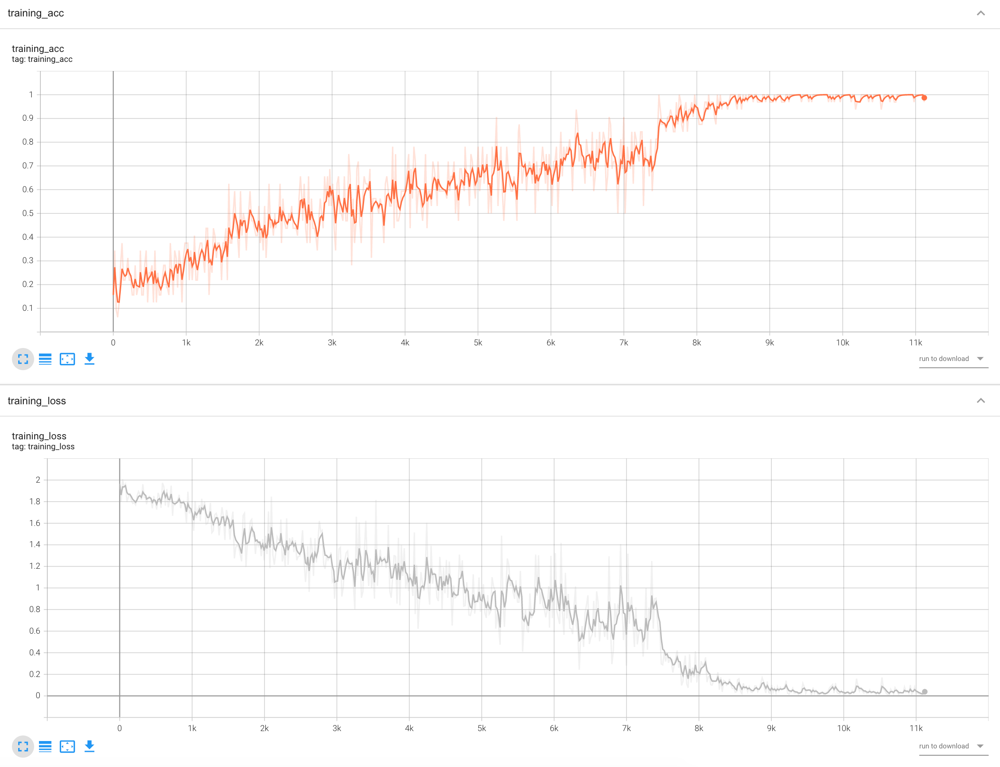

- 实验5 (`learning_rate = 0.1, batch_size = 128`)

  

- 实验6 (`learning_rate = 0.1, batch_size = 256`)

  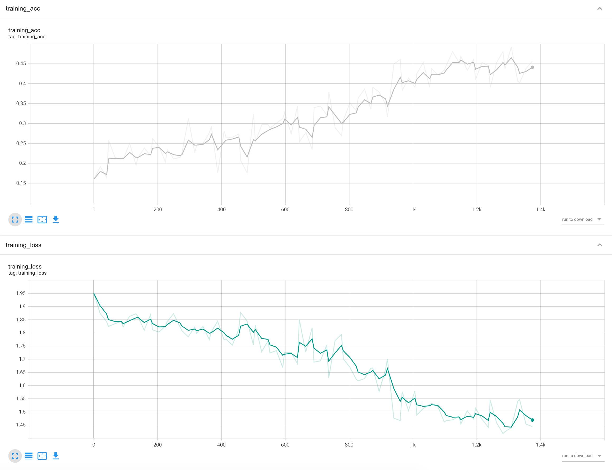

实验0和实验3是由于学习率过低，导致loss降低缓慢、准确率上升缓慢，这样容易陷入局部最优；实验2是由于学习率过高出现了梯度爆炸的情况。实验6是由于batch size设置的过大，并且学习率没有同步增大、训练轮数不够，导致效果不好，但loss仍然处在下降的趋势中，进一步训练可能会提升效果。实验1、4、5的参数设置基本合理，可以在此基础上进一步优化。

将7次实验的准确率曲线和loss曲线分别放在同一张图上能够更直接看出它们之间的差别。

- 准确率曲线

  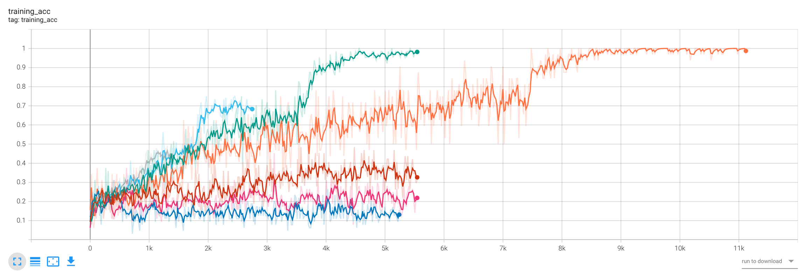

- loss曲线

  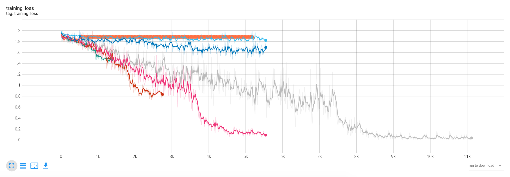

#### 2.5.3 样本特征分布

采用t-SNE和seaborn对样本特征分布进行降维和可视化。

这里仅展示实验0（测试集准确率为0.3304）的训练集、测试集样本特征分布和实验1（测试集准确率为0.5368）的训练集、测试集样本特征分布。

- 实验0（测试集准确率0.3304）

  - 训练集

    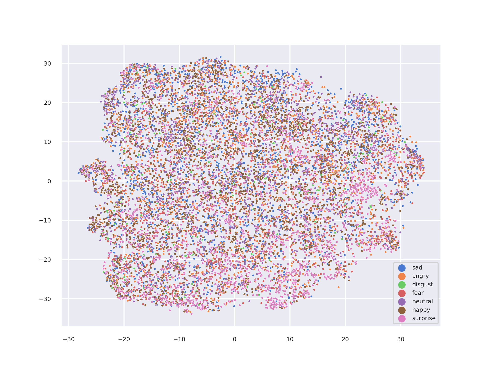

  - 测试集

    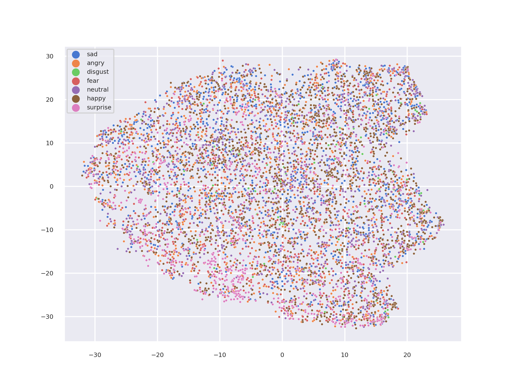

- 实验1（测试集准确率0.5368）

  - 训练集

    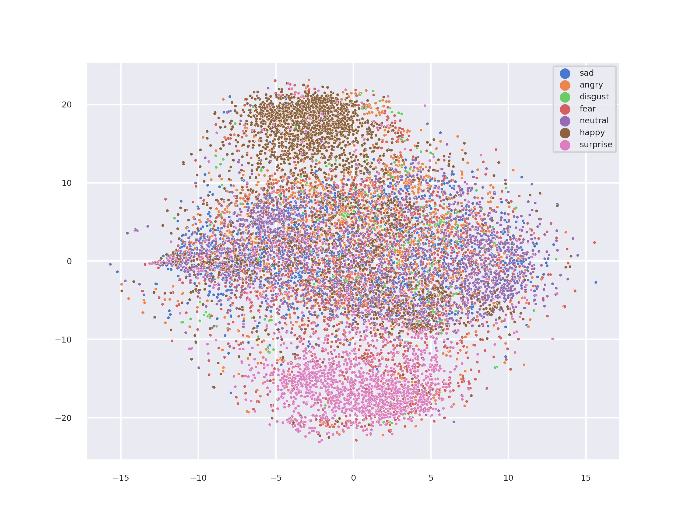

  - 测试集

    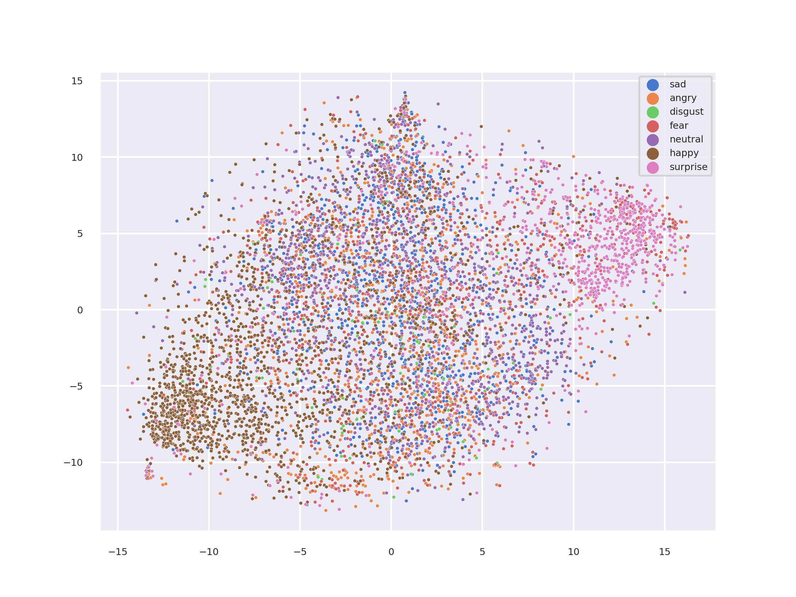

能够看出，实验1相比于实验0，同标签的样本已经表现出聚集的行为，而训练集的比测试集的效果好；但中间部分的划分仍不明显，进一步改善模型有望优化样本特征分布。

## 3 模型的改善

### 3.1 任务

尝试任意改善模型的方式，包括但不限于以下方式：

- 训练数据的使用（数据增强、使用更多训练数据）
- 网络结构的调整
- 调整损失函数
- 调整训练方式

### 3.2 思路

1. 尝试新的思路（提取人脸特征点，采用传统方式或MLP进行分类）
2. 加入超分辨率重建
3. 数据增强，使用PyTorch的方法进行数据增强
4. 调整网络结构，采用AlexNet、VGG、ResNet这些网络进行训练，自己搭建网络进行训练
5. 进行损失函数的尝试，使用PyTorch提供的损失函数
6. 优化训练方式

### 3.3 实现细节

我们尝试了一个新的思路，通过开源工具`dlib`将人脸提取我们先通过一系列尝试，得到一个最优的模型，然后进行消融实验，验证各部分的有效性。

#### 3.3.1 dlib人脸特征提取

我们通过开源工具`dlib`将人脸提取为128维的向量，即一张$48 \times 48$的图像就转换为一个$1\times 128$的向量。然后分别使用：

- SVM分类器
- 随机森林分类器
- MLP分类器

进行分类。

#### 3.3.2 超分辨率重建

在实验过程中，我们认为$48\times 48$的分辨率对于表情识别的任务而言，并不是一个合适的分辨率，所以期待通过一种算法达到提升分辨率的效果。参考遥感领域的“超分辨率重建”，我们对数据集进行如下处理：

- 原图像分辨率：$48 \times 48$
- 重建图像分辨率：$192 \times 192$
- 算法：`SRGAN`

随后我们在重建前后的两个数据集上对相同算法进行训练和测试，验证效果。

#### 3.3.3 数据增强

采用如下代码段进行数据增强：

```python
transforms.Compose([
  transforms.RandomHorizontalFlip(),
  transforms.RandomRotation(30),
  transforms.Resize([self.img_size, self.img_size]),
  transforms.ToTensor(),
  transforms.Normalize(mean=[0.5, 0.5, 0.5], std=[0.5, 0.5, 0.5]),
])
```

说明：

- `RandomHorizontalFlip()`为随机水平翻转
- `RandomRotation(30)`为随机顺时针或逆时针旋转0~30度
- `Normalize(mean=[0.5, 0.5, 0.5], std=[0.5, 0.5, 0.5])`为数据归一化

#### 3.3.4 调整网络结构

我们实验了一些经典的神经网络，并自己搭建了一个模型。

经典的神经网络包括：

- `AlexNet`
- `Densenet121`
- `GoogLeNet`
- `MobileNetV3`
- `ResNet18`
- `ResNet50`
- `VGG11`
- `VGG16`

同时，我们自己搭建的模型结构如图所示：


原理图如下图所示：

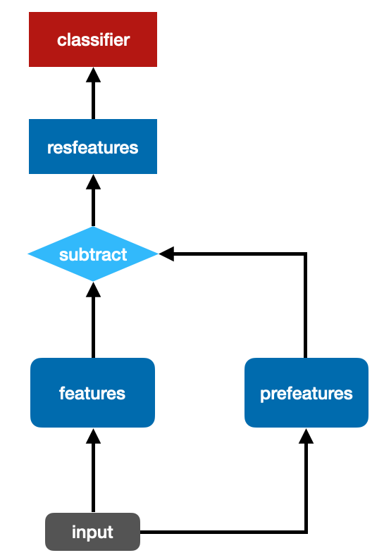

各部分功能

- features模块：卷积层和池化层提取图像的深层特征
- prefeatures模块：卷积层和池化层提取图像的浅层特征
- 用深层特征减去浅层特征得到残差特征
- resfeatures模块：卷积层和池化层对残差特征进一步提取特征
- classifier模块：用全连接层对特征进行分类

#### 3.3.5 损失函数

因为我们是一个多分类任务，所以采用交叉熵损失函数，因为其最适用于多标签多分类的场景。

#### 3.3.6 优化训练方式

最初全部采用Adam优化器，随后在我们自己提出的模型和VGG16上尝试Adam+SGD的训练方式，先使用Adam使得模型快速收敛，再使用SGD进行精细调优，对比效果。

## 4 实验

### 4.1 dlib人脸特征提取

| 算法     | 是否超分辨重建 | 参数组[起始学习率，学习率变更点，epoch数] | 测试集准确率 |
| -------- | -------------- | ----------------------------------------- | ------------ |
| SVM      | 否             | -                                         | 42.76%       |
| SVM      | 是             | -                                         | 42.83%       |
| 随机森林 | 否             | -                                         | **47.02%**   |
| 随机森林 | 是             | -                                         | 46.61%       |
| MLP      | 否             | [3e-3, [50, 70, 90], 100]                 | 46.49%       |
| MLP      | 是             | [3e-3, [50, 70, 90], 100]                 | 46.34%       |
| MLP      | 否             | [3e-3, [90], 100]                         | 46.56%       |
| MLP      | 是             | [3e-3, [90], 100]                         | 46.30%       |
| MLP      | 否             | [3e-3, [70, 140, 170], 200]               | 46.84%       |
| MLP      | 是             | [3e-3, [70, 140, 170], 200]               | 45.84%       |

可见，无论是否采用超分辨率重建，对通过`dlib`提取出的128维特征进行传统算法或全连接层的分类，工作得不是很好，最高准确率达到了47.02%。

上述6个MLP的训练过程整体上较为相似，模型的效果也相似。

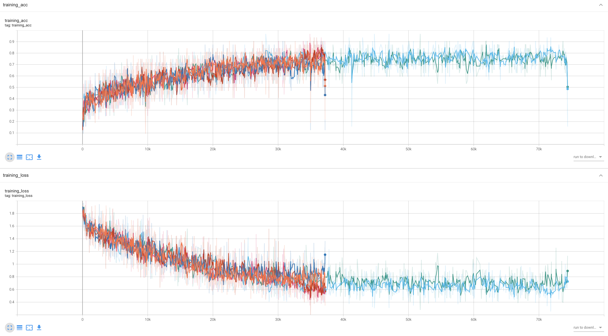

在以下的实验中，我们均讨论深度神经网络算法。

### 4.2 数据增强

我们在以下模型的超分辨率重建的数据集上对数据增强进行了消融实验，验证了数据增强能够提升神经网络的泛化能力：

- `AlexNet`
- `Densenet121`
- `GoogLeNet`
- `MobileNetV3`
- `ResNet18`
- `ResNet50`
- `VGG11`
- `VGG16`

测试结果见下表（两组实验的训练参数相同）

| 模型          | 数据增强后的准确率 | 不进行数据增强的准确率 |
| ------------- | ------------------ | ---------------------- |
| `AlexNet`     | **61.61%**         | **58.82%**             |
| `Densenet121` | 54.47%             | 50.32%                 |
| `GoogLeNet`   | 55.14%             | 52.78%                 |
| `MobileNetV3` | 57.64%             | 55.55%                 |
| `ResNet18`    | 58.20%             | 56.82%                 |
| `ResNet50`    | 58.14%             | 54.68%                 |
| `VGG11`       | 61.07%             | **58.20%**             |
| `VGG16`       | **61.49%**         | 57.29%                 |

所有模型进行数据增强后的准确率均高于不进行数据增强的准确率。

以VGG16为例，我们尝试分析出现这种情况的原因：

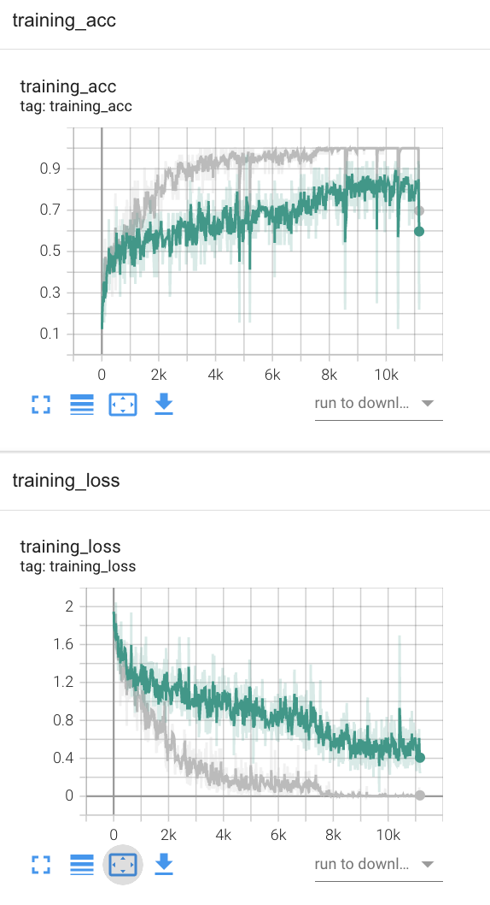

如图所示，绿色的曲线代表进行数据增强的训练、验证集上loss和acc的变化，灰色的曲线代表不进行数据增强的训练、验证集上loss和acc的变化。可见，在不进行数据增强的情况下，模型迅速收敛，但出现了过拟合的情况，具体表现在验证集上的loss异常升高。

说明，数据增强能够有效避免过拟合，提高模型的泛化能力。

### 4.3 超分辨率重建

因为原始分辨率为$48\times 48$，对于表情识别而言可能有些低，我们尝试采用遥感领域的超分辨率重建算法，对数据集进行超分辨率重建，重建后的分辨率为$192\times 192$，对比相同算法、同样训练参数在两个数据集上的表现。

超分辨率重建效果对比（左为重建，右为原图）：


我们进行对比实验的模型为：

- `ResNet50`
- `MobileNetV3`
- `AlexNet`
- `VGG16`

实验结果为：

| 模型          | 重建数据集准确率 | 原始数据集准确率 |
| ------------- | ---------------- | ---------------- |
| `ResNet50`    | 58.14%           | 61.75%           |
| `MobileNetV3` | 57.64%           | 61.92%           |
| `AlexNet`     | 61.61%           | 62.28%           |
| `VGG16`       | **61.49%**       | **63.59%**       |

可见，超分辨率重建并没有如预期一样，我们对训练过程进行分析，尝试找到原因。

以VGG16为例：

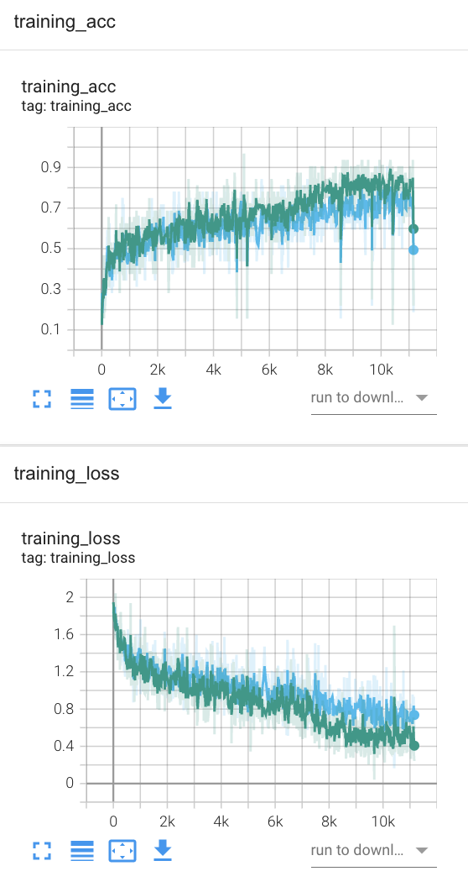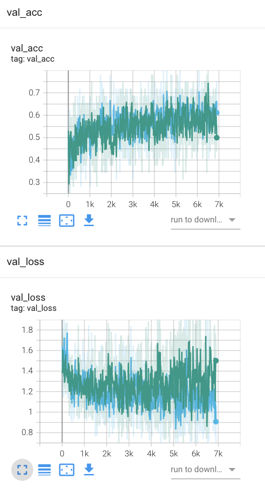

蓝色曲线为原始数据集的训练，绿色曲线为超分辨率重建后数据集的训练。观察发现，超分辨率重建后的数据也出现了过拟合的情况，应该更改参数或者加入正则化用来避免过拟合。

除此之外，超分辨率重建也可能会引入噪声，从而给模型的效果带来负面影响。

### 4.4 调整网络结构

我们在超分辨率重建后的数据集上，加入数据增强的条件下，进行不同模型的训练，训练结果整理如下表：

| 模型          | 测试集准确率 |
| ------------- | ------------ |
| **`Ours`**    | **60.83%**   |
| `AlexNet`     | 61.61%       |
| `Densenet121` | 54.47%       |
| `GoogLeNet`   | 55.14%       |
| `MobileNetV3` | 57.64%       |
| `ResNet18`    | 58.20%       |
| `ResNet50`    | 58.14%       |
| `VGG11`       | 61.07%       |
| `VGG16`       | 61.49%       |

我们查看`Densenet121`、`AlexNet`和`Ours`的训练过程：

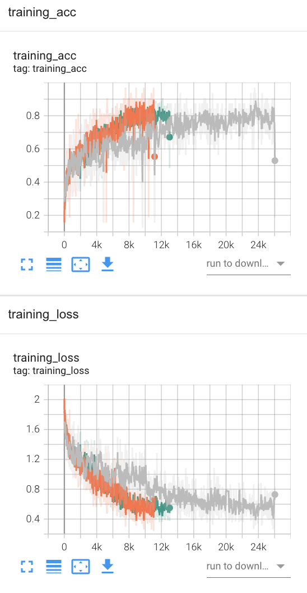

灰色曲线为`AlexNet`，橙色曲线为`Densenet121`，绿色曲线为`Ours`。可见，橙色曲线已经出现了明显的过拟合，所以验证集上准确率不高。

### 4.5 模型调优

我们采用的方式是先用Adam优化器使模型迅速收敛，再用SGD进行缓慢调优，发现确实是一个可行的方式。

| 模型           | 测试集准确率 |
| -------------- | ------------ |
| Step1(Adam)    | 52.92%       |
| **Step2(SGD)** | **60.62%**   |
| Adam           | 60.83%       |

虽然Step2的准确率未超过原来的训练方式，但从下图中可以看出，模型仍然有提高的潜力，但SGD收敛实在是太缓慢了，故停止实验。

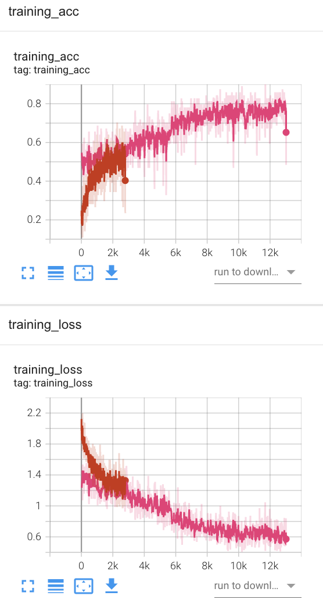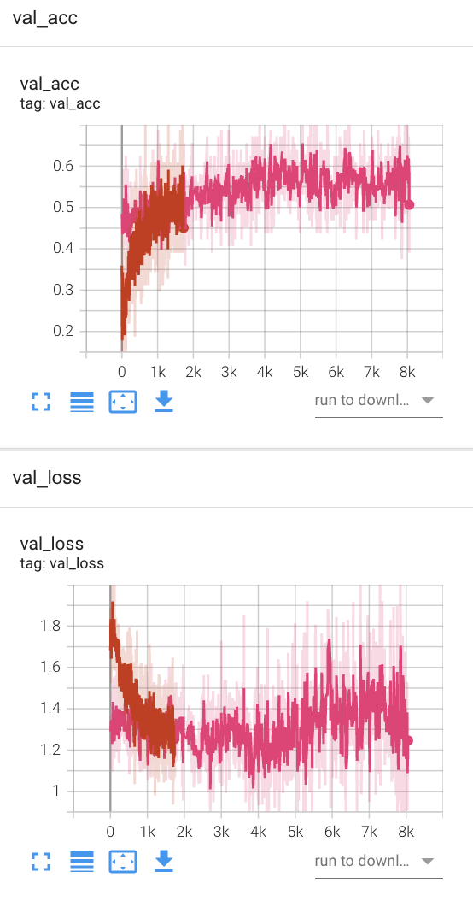

## 5 精细调优模型

### 5.1 策略

我们在自己搭建的网络上采用“大熊猫策略”（顾名思义，大熊猫比较珍稀，所以需要仔细调节参数，一但爆炸就立刻停止训练，返回上一个保存点，修改参数重新训练；与之相反的是“翻车鱼”策略，即一次训练很多组参数，找最好的，就像翻车鱼每次都会产很多很多卵）进行训练，分成了四个步骤：

1. 超分辨率重建数据集，Adam训练
2. 原数据集，Adam训练
3. 原数据集，SGD训练
4. 原数据集，SGD训练

### 5.2 参数

| Step | Dataset | learning rate | milestones   | batch size | epoch | Acc        |
| ---- | ------- | ------------- | ------------ | ---------- | ----- | ---------- |
| 1    | srdata  | 1e-3          | [20, 40, 60] | 64         | 70    | 60.51%     |
| 2    | data    | 1e-3          | [20, 40, 60] | 64         | 70    | 61.61%     |
| 3    | data    | 1e-2          | [40]         | 64         | 60    | 61.57%     |
| 4    | data    | 1e-3          | [40]         | 64         | 60    | **61.74%** |

### 5.3 训练

训练过程（从左至右分别为Step1～4）

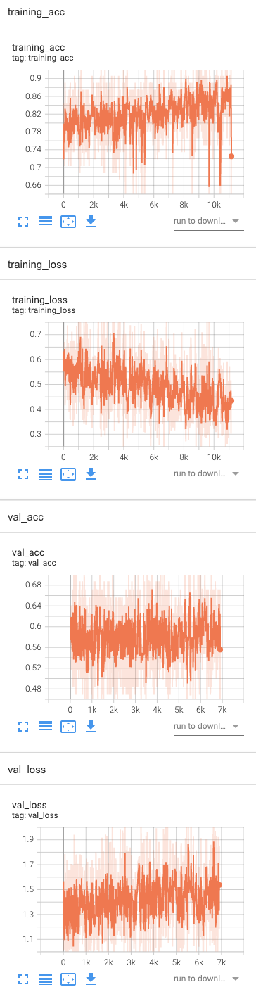

### 5.4 测试

测试结果

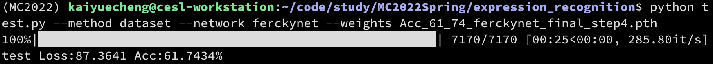

## 6 代码结构

为了方便实验，我们对代码进行了重构，结构如下所示：

```
├── train.py	# 训练模型
├── test.py		# 测试模型
├── baseline/	# 中期报告以前的工作
├── config/		# 配置文件，路径、参数等
├── data/			# 原始数据集
├── srdata/		# 超分辨率重建后的数据集
├── demo/			# 测试用的文件
├── dataset/	# 加载数据集
├── models/		# 模型，包括现有的和自己搭建的
├── result/		# 数据结果文件
├── runs/			# tensorboard的工作空间
├── utils/		# 项目中用到的工具
├── weights/	# 训练好的权重
├── run.sh		# 训练脚本，自用
├── test.jpg	# 测试图像
├── requirements.txt # 环境信息
```

有两处参考：

1. 超分辨率重建代码
   - 在本项目中的`./srdata/resplutils/`路径下
   - 参考：https://blog.csdn.net/qianbin3200896/article/details/104181552
2. 人脸检测代码
   - 在本项目中的`./utils/mxnet_mtcnn_face_detection/`路径下
   - 参考：https://github.com/YYuanAnyVision/mxnet_mtcnn_face_detection

## 7 测试代码

实现了三种测试方式：

- 测试集上进行测试
- 单张图像测试
- 摄像头实时人脸检测+表情识别

单张图像测试：


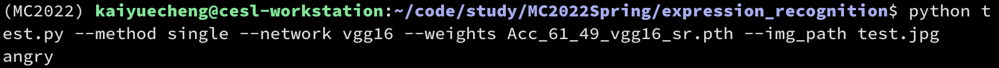

演示视频：https://cloud.tsinghua.edu.cn/d/0af3085748694985ac22/

视频截图：


## 8 主要工作

- 人脸关键点提取
  - 引入`dlib`的人脸关键点提取
  - 将原始数据集提取成矩阵形式，保存在`./result/feature/`路径下
- 数据
  - 引入超分辨率重建
  - 采用`ImageFolder`重新编写`Dataset`和`DataLoader`类
  - 针对`dlib`提取出的特征重新编写`Dataset`和`DataLoader`类
- 模型
  - 调整现有网络的最后一层
  - 自己搭建了一个深浅特征残差的神经网络模型
- 训练
  - 采用tensorboard对loss和acc可视化
  - 尝试Multi-Step的训练，Adam+SGD的方式
- 测试
  - 实现了三类测试方式
    - 测试集
    - 单张图像
    - 从摄像头读取，人脸检测，识别后输出

全部训练记录

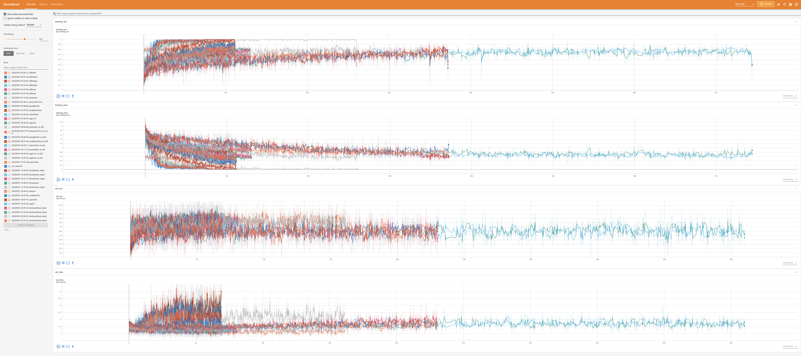

## 9 运行方式

### 9.1 配置环境

```shell
pip install -r requirements.txt
```

### 9.2 路径

权重文件链接：https://cloud.tsinghua.edu.cn/d/0af3085748694985ac22/

说明：由于模型过多，我们只提供几个准确率较高的模型，如果需要其余模型，请与作者联系。

```
'srdata'中的文件夹->./srdata
'weights'整个文件夹->./
'results'整个文件夹->./srdata/resplutils
'runs'整个文件夹（训练过程记录）->./
'feature'整个文件夹->./result
'data'整个文件夹->./data
'baseline相关'内的所有文件夹->./baseline
```

- 权重相关
  - 01-神经网络模型权重文件：`./weights`
  - 02-`dlib`权重文件：`./weights`
  - 03-`mxnet`模型参数：`./utils/mxnet_mtcnn_face_detection/model`
  - 04-超分辨率重建权重：`./sedata/resplutils/results`
- 数据集相关
  - 05-超分辨率重建数据集：`./srdata`（分成`train, test, val`）
  - 06-原始数据集：`./data`（分成`train, test, val`）
  - 07-`dlib`特征文件：`'./result/feature`
- `baseline`相关
  - 08-`baseline`的`feature`：`./baseline/feature`
  - 09-`baseline`的数据集：`./baseline/fer`
  - 10-`baseline`的权重：`./baseline/weights`
- `tensorboard`相关
  - 11-训练时的信息记录：`./runs`

### 9.3 超分辨率重建

如果完成了上面的步骤，则不需要此步骤。

```shell
cd srdata
python resample.py
```

### 9.4 训练

示例

```shell
python train.py --method cnn --network vgg16 --pretrained True --debug False
或
python train.py --method cnn --network vgg16 --pretrained False --debug False --step2 True --pre_model Acc_63_59_vgg16.pth
```

### 9.5 测试

示例

```shell
python test.py --method realtime --network ferckynet --weights Acc_61_74_ferckynet_final_step4.pth
或
python test.py --method single --network ferckynet --weights Acc_61_74_ferckynet_final_step4.pth --img_path test.jpg
```

## 10 不足与总结

- 代码没注释，一方面是结构确实比较简单，另一方面是时间比较紧
- 接上一条，时间略紧，模型没有完全收敛就停止训练了，参数也不是最优的
- 有一些地方都代码不是很讲究，没有统一到config里面，不过也无伤大雅，但就是不太舒服

还有很多值得改进的地方，继续加油。等考试周过去，我会整理一下放到GitHub上，也算是对这段时间工作的一个整理吧。

**TODO List**

- [x] 运行基准模型
  - [x] 配环境
  - [x] 调通
  - [x] 读懂
  - [x] 运行，给出准确率
- [x] 实验结果分析
  - [x] loss、准确率的变化
  - [x] 超参数对性能的影响
  - [x] 样本的特征分布
- [x] 模型的改善
  - [x] 数据
  - [x] 网络结构
  - [x] 损失函数
  - [x] 训练方式
  - [x] 实时检测+识别

